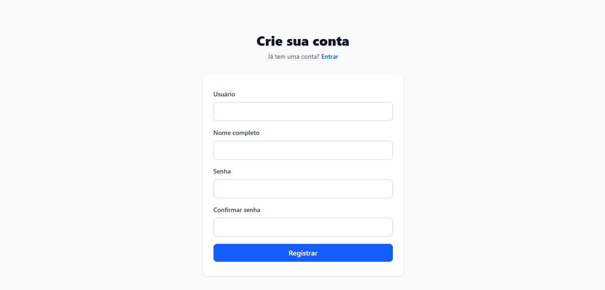
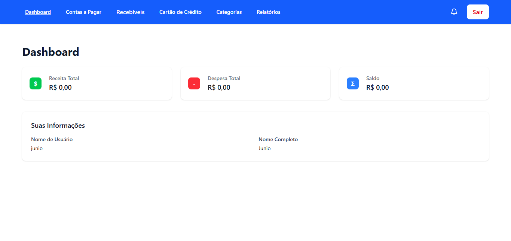
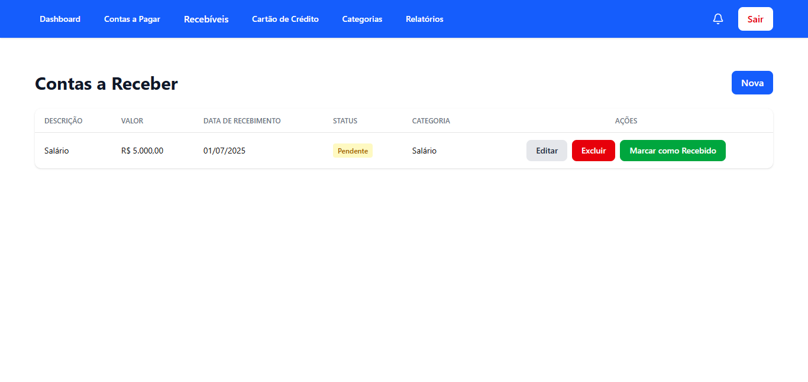
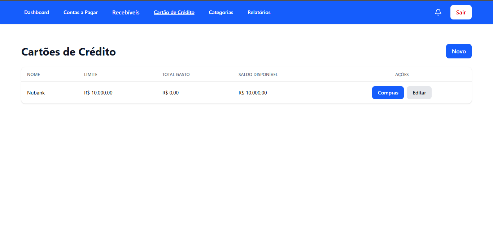
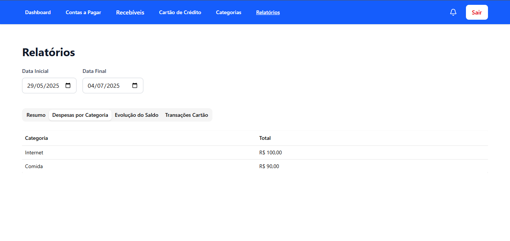
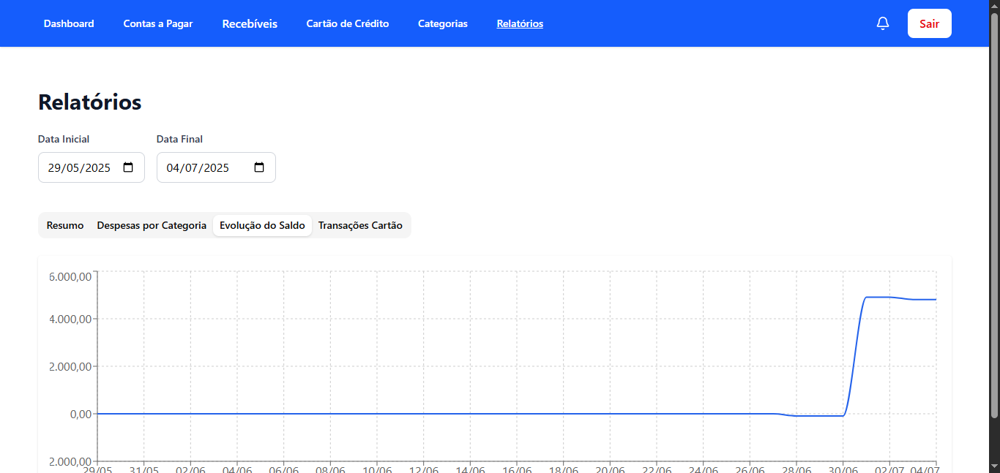

# 💰 Sistema de Gestão Financeira Pessoal

Um sistema completo de controle financeiro pessoal desenvolvido com ASP.NET Core e React, com autenticação JWT, relatórios avançados e interface moderna.

## 🎯 Sobre o Projeto

Sistema de gestão financeira que permite controlar receitas, despesas, cartões de crédito e gerar relatórios detalhados. Desenvolvido como prova prática para vaga de desenvolvedor C# Junior.

## ✨ Funcionalidades

### 🔐 Autenticação e Segurança

- Cadastro e login de usuários
- Autenticação JWT com refresh tokens
- Proteção de rotas no frontend e backend
- Validação de dados em tempo real

### 📊 Dashboard e Relatórios

- Dashboard com resumo financeiro dos últimos 30 dias
- Gráficos de evolução do saldo
- Relatórios de despesas por categoria
- Relatórios de transações do cartão de crédito
- Filtros personalizáveis por período

### 💳 Gestão Financeira

- **Contas a Pagar:** Cadastro, edição e controle de vencimentos
- **Contas a Receber:** Gestão de receitas com suporte a recorrência
- **Cartões de Crédito:** Controle de limites, saldos e compras
- **Parcelas:** Visualização e controle de compras parceladas
- **Categorização:** Organização por categorias personalizáveis

### 🎨 Interface e UX

- Componentes reutilizáveis (inputs, modais, tabelas)
- Feedback visual (loading)

## 🛠️ Tecnologias Utilizadas

### Backend

- **ASP.NET Core 8.0** - Framework web
- **Entity Framework Core** - ORM
- **MySQL** - Banco de dados
- **JWT Bearer** - Autenticação
- **AutoMapper** - Mapeamento de objetos

### Frontend

- **React 18** - Biblioteca UI
- **TypeScript** - Tipagem estática
- **Vite** - Build tool
- **Tailwind CSS** - Framework CSS
- **React Router** - Roteamento
- **React Hook Form e zod** - Gerenciamento de formulários

### DevOps

- **Docker & Docker Compose** - Containerização
- **Nginx** - Servidor web (produção)

## 🚀 Como Executar

### Pré-requisitos

- [Docker](https://www.docker.com/get-started)
- [Docker Compose](https://docs.docker.com/compose/install/)
- Git

### Execução com Docker (Recomendado)

1. **Clone o repositório:**

   ```bash
   git clone https://github.com/JunioUHS/sistema-gestao-financeira.git
   cd sistema-gestao-financeira
   ```

2. **Execute a aplicação:**

   ```bash
   docker-compose up --build
   ```

3. **Acesse a aplicação:**
   - **Frontend:** http://localhost
   - **Backend API:** http://localhost:5097
   - **Banco de dados:** localhost:3306

### Execução Local (Desenvolvimento)

#### Backend

```bash
cd backend/ControleFinanceiro.Api
dotnet restore
dotnet run
```

#### Frontend

```bash
cd frontend
npm install
npm run dev
```

## 📁 Estrutura Principal do Projeto

```
├── backend/                    # API ASP.NET Core
│   ├── ControleFinanceiro.Api/
│   │   ├── Controllers/        # Controladores da API
│   │   ├── Services/          # Lógica de negócio
│   │   ├── Models/            # Modelos e DTOs
│   │   ├── Repositories/      # Acesso a dados
│   │   └── Middlewares/       # Middlewares customizados
├── frontend/                   # Aplicação React
│   ├── src/
│   │   ├── components/        # Componentes reutilizáveis
│   │   ├── pages/            # Páginas da aplicação
│   │   ├── services/         # Serviços de API
│   │   └── hooks/            # Hooks customizados
├── docker-compose.yml         # Configuração Docker
└── README.md
```

## 🔧 Configuração

### Variáveis de Ambiente

#### Backend (appsettings.json)

```json
{
  "ConnectionStrings": {
    "DefaultConnection": "Server=localhost;Database=financeiro;Uid=root;Pwd=123456;"
  },
  "Jwt": {
    "Key": "sua-chave-secreta-aqui",
    "Issuer": "ControleFinanceiro",
    "Audience": "ControleFinanceiro"
  }
}
```

#### Frontend (.env)

```env
VITE_API_URL=http://localhost:5097/api
```

## 📸 Screenshots

### 🔐 Autenticação

<!-- <div align="center">
  
  
</div> -->

<table>
  <tr>
    <td width="50%">
      
      <p align="center"><em>Login</em></p>
    </td>
    <td width="50%">
      
      <p align="center"><em>Novo Usuário</em></p>
    </td>
  </tr>
</table>

### 📊 Dashboard Principal



_Dashboard com resumo financeiro, gráficos e indicadores dos últimos 30 dias_

### 💰 Gestão de Contas

<table>
  <tr>
    <td width="50%">
      
      <p align="center"><em>Contas a Pagar</em></p>
    </td>
    <td width="50%">
      
      <p align="center"><em>Contas a Receber</em></p>
    </td>
  </tr>
</table>

### 💳 Cartões de Crédito

<div align="center">
  
</div>

_Controle de cartões de crédito com limites, saldos e histórico de compras_

### 📈 Relatórios Avançados

<table>
  <tr>
    <td width="50%">
      
      <p align="center"><em>Relatório de Despesas por Categoria</em></p>
    </td>
    <td width="50%">
      
      <p align="center"><em>Evolução do Saldo</em></p>
    </td>
  </tr>
</table>

## 🤝 Como Contribuir

1. Faça um fork do projeto
2. Crie uma branch para sua feature (`git checkout -b feature/nova-funcionalidade`)
3. Commit suas mudanças (`git commit -m 'Adiciona nova funcionalidade'`)
4. Push para a branch (`git push origin feature/nova-funcionalidade`)
5. Abra um Pull Request

## 📝 Licença

Este projeto está sob a licença MIT. Veja o arquivo [LICENSE](LICENSE) para mais detalhes.

## 👨‍💻 Autor

**Junio Nunes**

- GitHub: [JunioUHS](https://github.com/JunioUHS)
- LinkedIn: [Junio Nunes](https://www.linkedin.com/in/junio-nunes-8609a1183)

---

⭐ Se este projeto foi útil para você, considere dar uma estrela!
